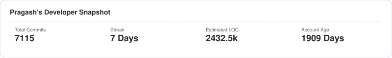
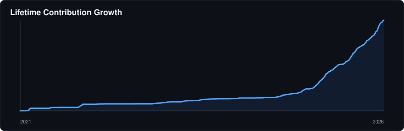
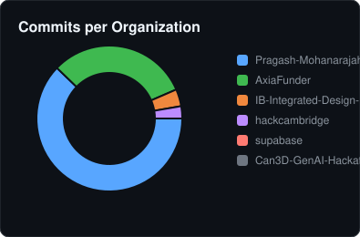
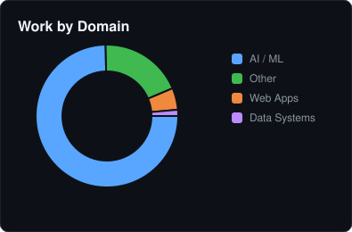
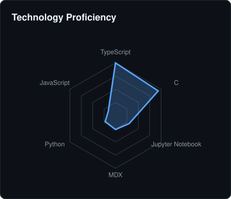
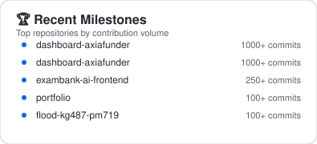
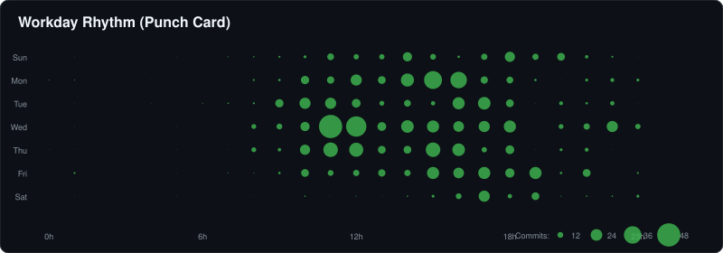
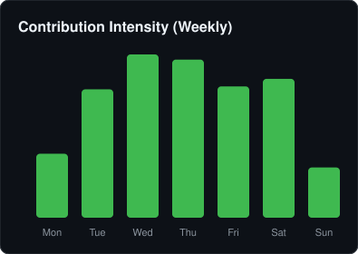

## 🏢 Work & Organizational Tracker

  

Detailed breakdown of contributions across professional and personal entities.

### 📊 High-Level Metrics

  

  
  

### 🕸️ Expertise & Milestones

  
  

### ⏰ Working Rhythm

  

  

