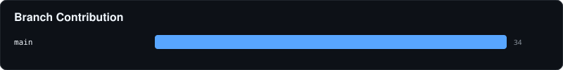
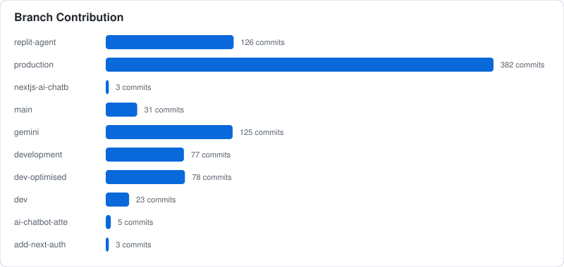
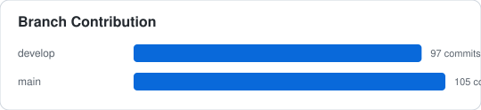
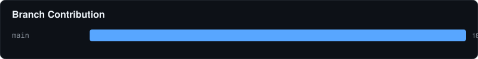
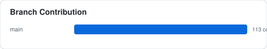
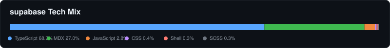
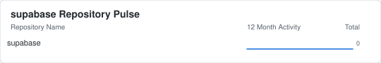
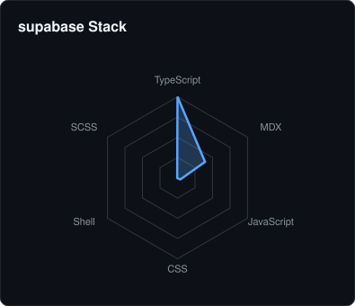
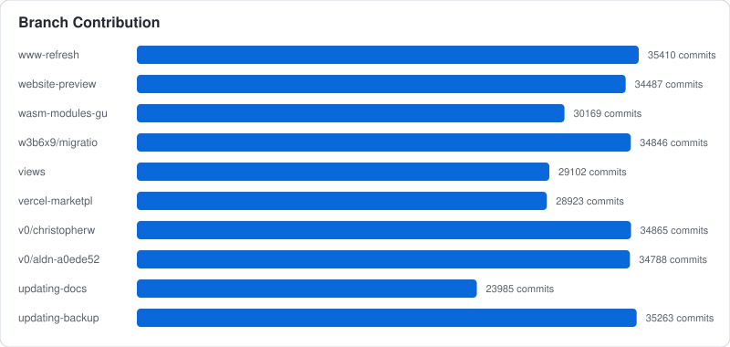
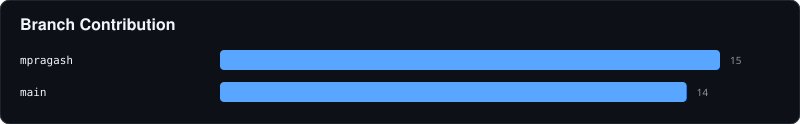

## 🏢 Work & Organizational Tracker
Detailed breakdown of contributions across professional and personal entities.

### 📊 High-Level Metrics

  
  

### 🕸️ Expertise & Domains

  
  

### ⏰ Working Rhythm

  
  

---
#### 🏛️ Pragash-Mohanarajah
- **Total Repositories:** 59
- **Primary Stack:** 

  
  

##### 📦 work-tracker
> Pragash's Internal Tracker for Work Related GitHub Activity

##### 📦 portfolio
> Pragash Mohanarajah: Personal Portfolio

##### 📦 Pragash-Mohanarajah
> My GitHub Profile

---
#### 🏛️ AxiaFunder
- **Total Repositories:** 3
- **Primary Stack:** 

  
  

##### 📦 dashboard-axiafunder
> No description provided.

##### 📦 landing-axiafunder
> No description provided.

##### 📦 axiafunder
> Monorepo for Axiafunder Applications

---
#### 🏛️ IB-Integrated-Design-Project-Group-M202
- **Total Repositories:** 2
- **Primary Stack:** 

  
  

##### 📦 competition-in-arena
> Configures and Operates all of the Components on the Arduino Uno Wi-Fi Rev 2 Board

##### 📦 component-connection-status
> Tests the Connection Status of each Component on the Arduino Uno Wi-Fi Rev 2 Board

---
#### 🏛️ hackcambridge
- **Total Repositories:** 17
- **Primary Stack:** 

  
  

##### 📦 hc-archive
> No description provided.

##### 📦 hc-foundation
> The Hack Cambridge Foundation Website

##### 📦 hc-foundation-lite
> Hack Cambridge Foundation Website Lite - Testing

---
#### 🏛️ supabase
- **Total Repositories:** 1
- **Primary Stack:** 

  
  

##### 📦 supabase
> The Postgres development platform. Supabase gives you a dedicated Postgres database to build your web, mobile, and AI applications.

---
#### 🏛️ Can3D-GenAI-Hackathon-Cambridge
- **Total Repositories:** 1
- **Primary Stack:** 

  
  

##### 📦 shap-e
> Generate 3D objects conditioned on text or images

---