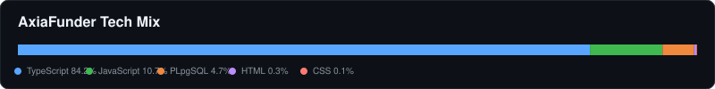
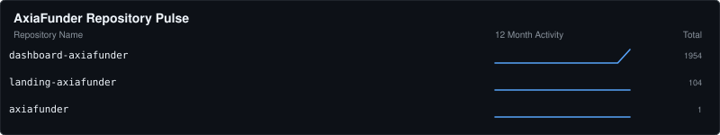
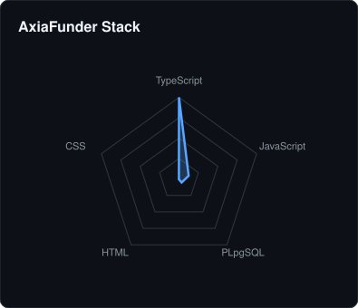
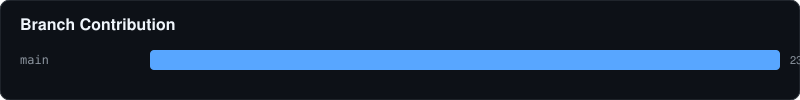
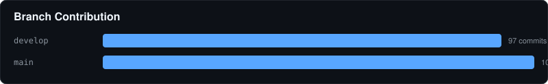

# 🏛️ AxiaFunder Contribution Report
- **Total Repositories:** 3
- **Primary Stack:** TypeScript, JavaScript, PLpgSQL

### 📦 Key Projects

#### 📦 dashboard-axiafunder
> No description provided.

#### 📦 landing-axiafunder
> No description provided.

#### 📦 axiafunder
> Monorepo for Axiafunder Applications

---
⬅️ Back to Global Overview