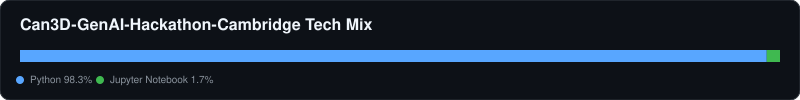
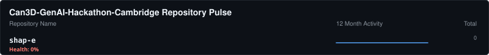

# 🏛️ Can3D-GenAI-Hackathon-Cambridge Contribution Report
- **Total Repositories:** 1
- **Primary Stack:** Python, Jupyter Notebook

### 📦 Key Projects

#### 📦 shap-e
> Generate 3D objects conditioned on text or images

---
⬅️ Back to Global Overview