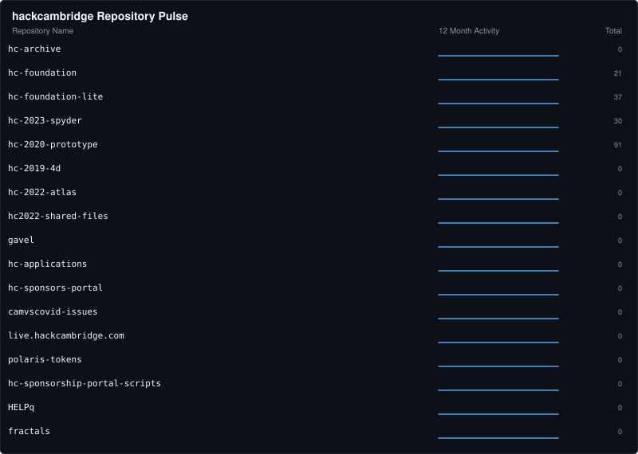
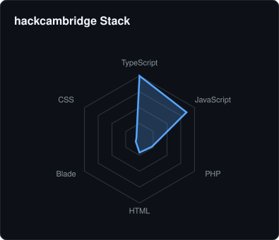
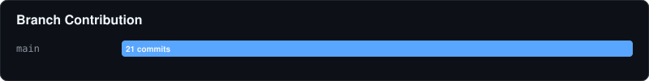

# 🏛️ hackcambridge Contribution Report
- **Total Repositories:** 17
- **Primary Stack:** TypeScript, JavaScript, PHP

### 📦 Key Projects

#### 📦 hc-2020-prototype
> Bespoke hackathon administration platform build for Hack Cambridge.

#### 📦 hc-foundation-lite
> Hack Cambridge Foundation Website Lite - Testing

#### 📦 hc-2023-spyder
> Hack Cambridge Spyder Website 1 Temporary

#### 📦 hc-foundation
> The Hack Cambridge Foundation Website

#### 📦 hc-archive
> No description provided.

---
⬅️ Back to Global Overview