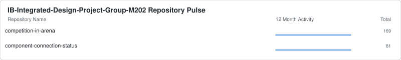
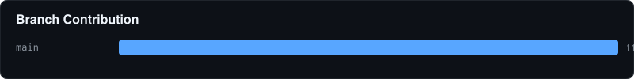

# 🏛️ IB-Integrated-Design-Project-Group-M202 Contribution Report
- **Total Repositories:** 2
- **Primary Stack:** C++, C

### 📦 Key Projects

#### 📦 competition-in-arena
> Configures and Operates all of the Components on the Arduino Uno Wi-Fi Rev 2 Board

#### 📦 component-connection-status
> Tests the Connection Status of each Component on the Arduino Uno Wi-Fi Rev 2 Board

---
⬅️ Back to Global Overview