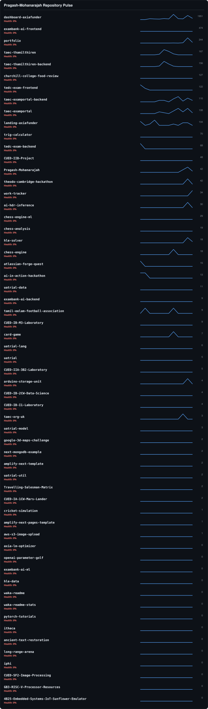
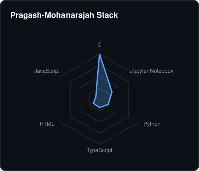
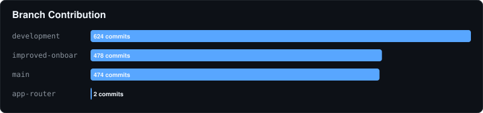

# 🏛️ Pragash-Mohanarajah Contribution Report
- **Total Repositories:** 59
- **Primary Stack:** C, Jupyter Notebook, Python

### 📦 Key Projects

#### 📦 dashboard-axiafunder
> AxiaFunder Internal Dashboard Application built with Next.js and Vercel (Forked from AxiaFunder/dashboard-axiafunder)

#### 📦 exambank-ai-frontend
> Exambank AI - Frontend Code Repository (forked from AlphaFactory/exambank-frontend)

#### 📦 portfolio
> Pragash Mohanarajah: Personal Portfolio

#### 📦 taec-thamilthiren
> No description provided.

#### 📦 taec-thamilthiren-backend
> No description provided.

---
⬅️ Back to Global Overview